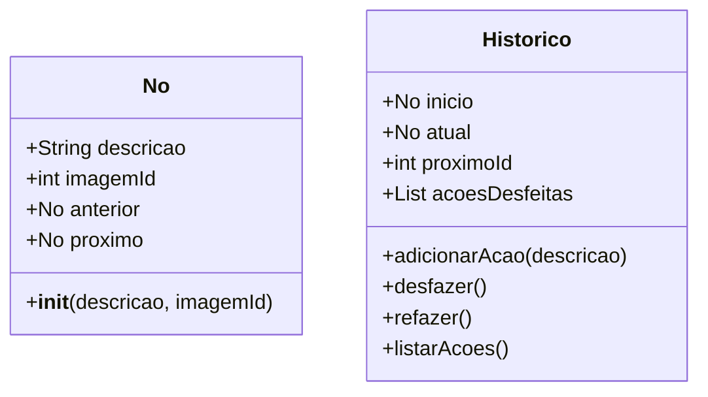
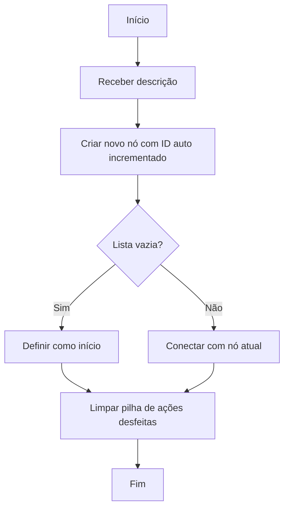
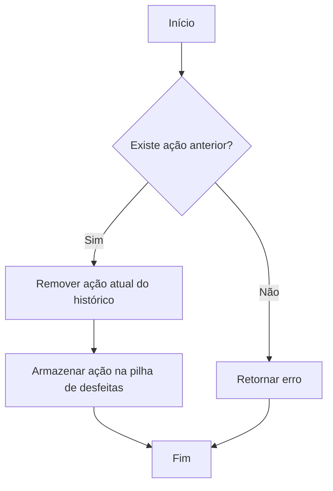
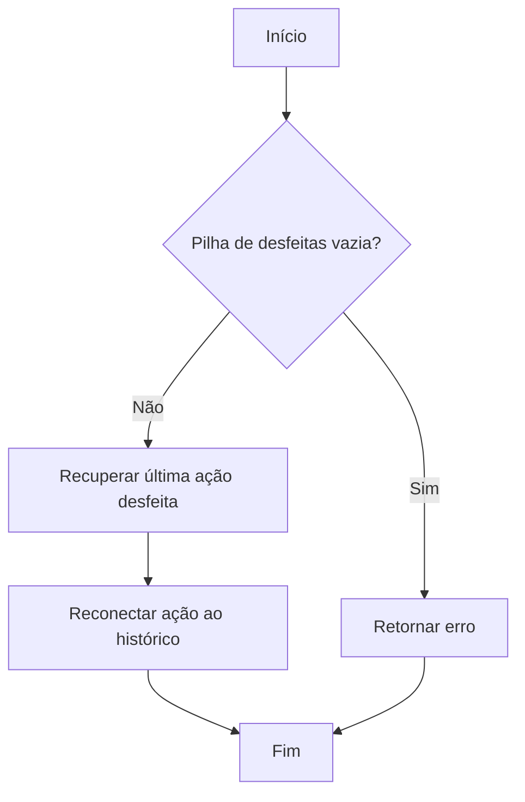
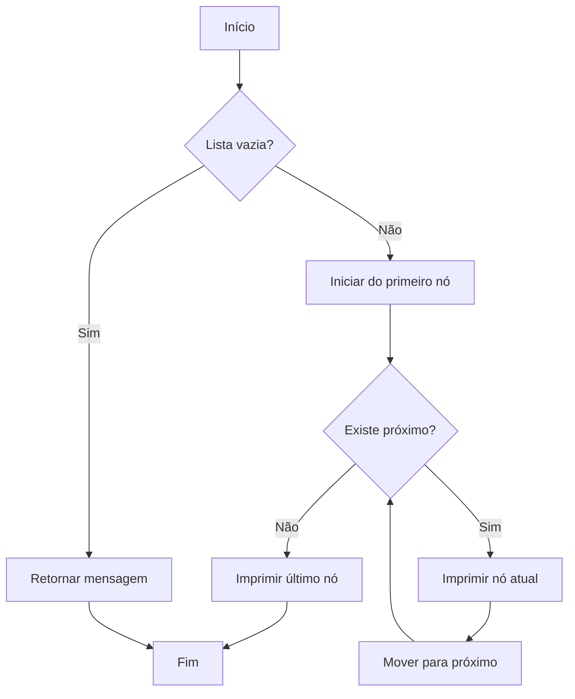

# Fluxograma do Sistema de Histórico de Edição de Imagens

## Estrutura de Dados


## Fluxograma de Operações

### Adicionar Ação


### Desfazer Ação


### Refazer Ação


### Listar Ações


## Pseudocódigo das Operações Principais

### Adicionar Ação
```
PROCEDIMENTO adicionarAcao(descricao)
    novoNo <- CRIAR No(descricao, proximoId)
    proximoId <- proximoId + 1
    
    SE inicio = NULO ENTÃO
        inicio <- novoNo
        atual <- novoNo
    SENÃO
        novoNo.anterior <- atual
        atual.proximo <- novoNo
        atual <- novoNo
    FIM SE
    
    acoesDesfeitas <- []  // Limpa pilha de ações desfeitas
FIM PROCEDIMENTO
```

### Desfazer Ação
```
PROCEDIMENTO desfazer()
    SE atual.anterior ≠ NULO ENTÃO
        acaoAtual <- atual
        atual <- atual.anterior
        atual.proximo <- NULO
        acoesDesfeitas.ADICIONAR(acaoAtual)
        RETORNAR VERDADEIRO
    SENÃO
        RETORNAR FALSO
    FIM SE
FIM PROCEDIMENTO
```

### Refazer Ação
```
PROCEDIMENTO refazer()
    SE acoesDesfeitas.NÃO_ESTÁ_VAZIA() ENTÃO
        acaoRefeita <- acoesDesfeitas.REMOVER_ÚLTIMO()
        acaoRefeita.anterior <- atual
        atual.proximo <- acaoRefeita
        atual <- acaoRefeita
        RETORNAR VERDADEIRO
    SENÃO
        RETORNAR FALSO
    FIM SE
FIM PROCEDIMENTO
```

### Listar Ações
```
PROCEDIMENTO listarAcoes()
    SE inicio = NULO ENTÃO
        IMPRIMIR "Nenhuma ação no histórico"
        RETORNAR
    FIM SE
    
    noAtual <- inicio
    IMPRIMIR "Histórico de ações:"
    IMPRIMIR "------------------------------"
    
    ENQUANTO noAtual ≠ NULO FAÇA
        SE noAtual = atual ENTÃO
            IMPRIMIR "*", end=" "
        SENÃO
            IMPRIMIR " ", end=" "
        FIM SE
        IMPRIMIR "Descrição:", noAtual.descricao
        IMPRIMIR "ID da Imagem:", noAtual.imagemId
        IMPRIMIR "------------------------------"
        noAtual <- noAtual.proximo
    FIM ENQUANTO
FIM PROCEDIMENTO 